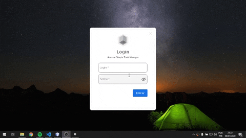
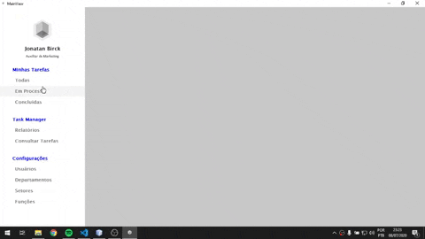
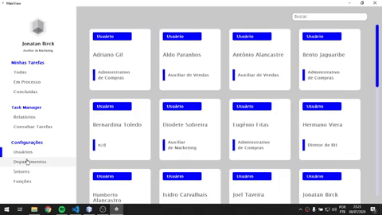
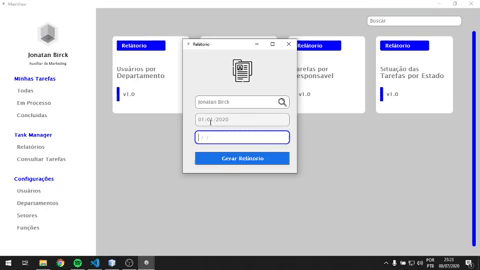

<h1 align="center">
   Simple Task Manager
</h1>

 

## :camera: Ilustrações

## :rocket: Tecnologias

✔️Java

✔️PostgreSQL

## 💻 Projeto

STM é uma aplicação desktop que permite aos usuários gerencias as tarefas de uma empresa, podendo realizar cadastros e gerar relatórios. Aplicação desenvolvida na disciplina de Programação de Aplicações.

## ⚙ Configuração

1- Para instalar o ambiente:
> Download PostgreSQL
> Download Netbeans and JDK

2- Preparar a aplicação
> Criar o banco de dados manualmente
> Criar as tabelas manualmente, arquivo "tablesDB.sql"
> Configurar classe ConnectionDB com as conexões

---

